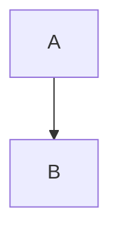

<h2 align="center"><code>mod_1</code></h2>
<h3 align="center"><i> Rust Module System testing and notes section </i></h3>

----

----

# Bastard 

1. Testing out rust module system since you keep forgeting 
2. This one will be just the modules and CLI terminal printing with not much 

# Structure 

