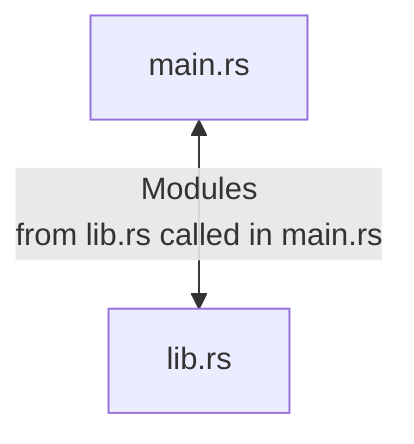
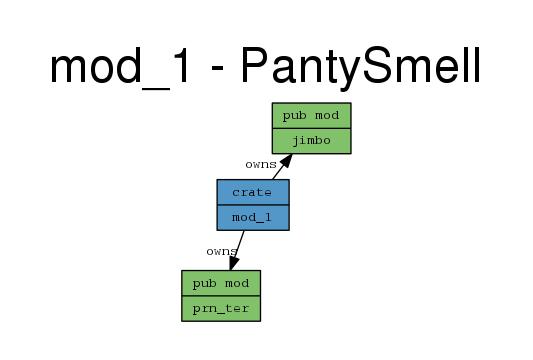

<h2 align="center"><code>mod_1</code></h2>
<h3 align="center"><i> Rust Module System testing and notes section </i></h3>

----
1. [Bastard](#bastard)
2. [Structure](#structure)
   1. [DOT File Diagram](#dot-file-diagram)

----

# Bastard 

1. Testing out rust module system since you keep forgeting 
2. This one will be just the modules and CLI terminal printing with not much 

# Structure 

This is what the repo and file look like 


## DOT File Diagram 

1. Genereated with the cargo module 

```rs 
cargo modules generate graph --lib &> g.dot
```

<p align="center">

</p>

- Note this exactly how this project is structured 
- These modules are defined in [`lib.rs`](./src/lib.rs) - You done need to name it as such, this si just so that you were learning 
- See [`lib.rs`](./src/lib.rs) and how you can put many modules in 1 file